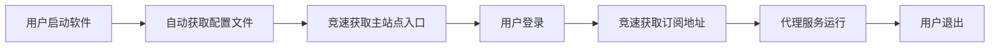

<div align="center">

# FlClash XBoard 版

[](https://github.com/chen08209/FlClash/releases/)
[](https://github.com/chen08209/FlClash/releases/)
[](LICENSE)

**基于 FlClash v0.8.85 的多平台代理客户端，深度集成全新 XBoard 面板支持**

[English](README.md) | [**简体中文**](README_zh_CN.md)

</div>

---

## 📖 项目简介

FlClash XBoard Edition 是基于 [FlClash v0.8.85](https://github.com/chen08209/FlClash) 的增强版本，深度集成了 **XBoard v20250905-b144770** 面板支持。本项目采用模块化设计理念，将所有 XBoard 相关功能封装在独立的 `lib/xboard` 模块中，最大限度减少与上游 FlClash 的代码冲突，便于后续跟进上游更新。

### 🎯 核心设计理念

- **FlClash 作为 Core**：将原版 FlClash 视为核心依赖，所有定制功能均在独立模块中实现
- **最小侵入式改动**：涉及原生 UI 修改时（如订阅组件），采用复制原实现并独立维护的方式
- **SDK 化设计**：XBoard SDK 独立于 FlClash，可方便嵌入其他 Flutter 项目使用
- **更新友好**：最大限度减少 `git pull` 上游更新时的合并冲突问题

---

## ✨ 核心特性

### 1️⃣ 入口域名防封锁机制

针对面板主域名可能被封锁的场景，提供了多层防护策略：

#### 🔸 方案一：内置代理访问（规划中）

- **功能说明**：通过客户端内置代理直接访问被封锁的主域名
- **当前状态**：待实现
- **存在问题**：HTTP/SOCKS5 代理是明文传输，存在代理泄漏和滥用风险

#### 🔸 方案二：国内中转服务器

提供两种国内可直接访问的方式：

**方式 A：国内服务器 IP + 端口**
```yaml
panels:
  your_brand:
    - url: https://10.0.0.1:8888
      description: "国内中转服务器"
```

**配置要求**：
- 在国内服务器上部署 Caddy 或其他反向代理工具
- 使用 IP+端口方式需生成私有证书
- 证书文件放置路径：`flutter_xboard_sdk/assets/cer/`
- 提供 HTTPS 访问能力

⚠️ **安全提示**：
- 可以在配置中关闭证书验证，但**极其不推荐**
- 关闭证书验证后，HTTP 数据将明文传输在互联网中

**方式 B：已备案域名**
```yaml
panels:
  your_brand:
    - url: https://your-domain.com
      description: "已备案域名"
```

#### 🔸 方案三：直接访问国外未被墙域名

如果你的面板域名托管在国外，且未被封锁，可以直接配置访问：

```yaml
panels:
  your_brand:
    - url: https://api-overseas.example.com
      description: "国外未被墙域名"
```

**适用场景**：
- 域名托管在海外云服务商（Cloudflare、AWS 等）
- 域名尚未被列入封锁名单
- 使用 CDN 加速服务，IP 分散

**优势**：
- ✅ 无需额外部署中转服务器
- ✅ 直连访问，延迟最低
- ✅ 配置简单，维护成本低
- ✅ HTTPS 证书由正规 CA 签发

**建议**：
- 配合域名竞速策略使用，混合配置国内外多个域名
- 定期监控域名可用性，及时切换备用域名
- 建议同时配置国内中转作为备用方案

#### 🔸 数据混淆与加密

**第一层：UA 对等密钥验证**

```yaml
security:
  user_agents:
    api_encrypted: Mozilla/5.0 (compatible; RmxDbGFzaC1XdWppZS1BUEkvMS4w)
```

- `RmxDbGFzaC1XdWppZS1BUEkvMS4w` 即为 Base64 编码的对等密钥
- 请求 UA 中必须携带此密钥才能被反向代理服务器认可
- 与后端 Caddy 配置约定一致

**第二层：API 响应混淆**

- 使用 Caddy 对 API 响应数据包进行混淆处理
- 基于 API 的自定义特性实现
- 产生与开源 XBoard 方案不同的数据特征
- **效果未知**：我们不确定这是否真的有用，但目前不可关闭

### 2️⃣ 高可用性保障

#### 🔸 域名竞速策略

```yaml
domain_service:
  enable: true                    # 启用域名竞速
  cache_minutes: 5                # 缓存 5 分钟
  max_concurrent_tests: 10        # 最大并发测试数
```

**工作原理**：
1. 并发请求配置文件中的所有域名
2. 返回响应最快的域名作为活跃入口
3. 立即终止对其他域名的请求
4. 最快域名响应即作为当前会话的入口域名

**应用场景**：
- ✅ 主站点入口域名竞速
- ✅ 订阅地址竞速获取
- ✅ 配置文件源竞速加载

**优势**：
- 确保始终使用最快的可用域名
- 提升用户体验
- 自动容灾切换

### 3️⃣ 配置文件托管方案

为确保配置文件的高可用性和安全性，支持双通道配置源：

#### 🔸 方案一：GitHub 私有仓库 + 代理服务器

   ```yaml
     remote_config:
       sources:
    - name: github_proxy
      url: https://proxy.example.com/api/v1/redirect/domains
           priority: 100
   ```

**特点**：
- 配置文件采用**明文**存储在 GitHub **私有仓库**
- 通过代理服务器中转访问 GitHub
- 客户端访问代理服务器获取配置
- 中转服务器返回**明文**配置

**优势**：
- 私有仓库保证安全性
- 通过代理访问，国内可达

#### 🔸 方案二：Gitee 公开仓库 + 客户端解密

```yaml
remote_config:
  sources:
    - name: gitee_encrypted
      url: https://gitee.com/your-org/repo/raw/branch/config.txt
      priority: 90
```

**特点**：
- 配置文件采用**加密文本**存储在 Gitee **公开仓库**
- 国内直连 Gitee，无需代理服务器
- 客户端携带密钥进行解密获取配置

**优势**：
- 国内直连，速度快
- 加密存储确保配置文件安全性
- 即使公开仓库也无法直接读取配置

### 4️⃣ 应用生命周期



**详细流程**：
1. **应用启动**：初始化客户端
2. **获取配置**：竞速访问多个配置源（GitHub 代理 / Gitee 直连）
3. **入口竞速**：并发测试所有主站点域名，选择最快的
4. **用户登录**：使用竞速获得的入口域名进行登录
5. **订阅竞速**：并发测试所有订阅域名，获取节点配置
6. **正常使用**：代理服务运行
7. **退出应用**

### 5️⃣ 扩展功能

#### 🔸 在线客服系统

```yaml
onlineSupport:
  - url: https://chat.example.com
    description: "在线客服"
    apiBaseUrl: https://chat.example.com
    wsBaseUrl: wss://chat.example.com
```

**功能说明**：
- 可直接在客户端访问的简单客服页面
- 需要独立部署客服后端服务
- 可实现**客户端 ↔ Telegram** 的消息转发
- 用户在 App 内提问，管理员在 TG 回复

#### 🔸 设备上报与远程任务系统（实验性功能）

```yaml
ws:
  - url: wss://report.example.com/ws/
    description: "设备上报服务器"
```

**功能说明**：
- 用户设备启动后，通过 WebSocket 连接后端服务器
- 上报客户端信息（设备类型、系统版本等）
- 代码中预留了 HTTPS 任务下发功能

**潜在用途**：
- 服务端可以给客户端下发 HTTPS 访问任务
- 理论上，1000 个用户 = 最多 1000 个设备的 HTTPS 任务能力
- 可用于统计分析、A/B 测试等场景

⚠️ **注意事项**：
- 这是一个比较有争议的功能
- 设计之初是为了上报客户端信息
- 远程任务功能请谨慎使用
- 使用前请充分告知用户并征得同意

---

## 🏗️ 架构设计

### 模块化结构

```
FlutterProjects/flclash/
├── core/                           # FlClash 核心（上游代码，不修改）
├── lib/
│   ├── xboard/                     # ✨ XBoard 独立模块
│   │   ├── sdk/                    # 独立 SDK 层
│   │   ├── config/                 # 配置管理
│   │   │   ├── utils/              # 配置工具
│   │   │   └── xboard_config.dart  # 配置类
│   │   ├── features/               # 业务功能
│   │   │   ├── auth/               # 登录注册
│   │   │   ├── subscription/       # 订阅管理（复制并修改）
│   │   │   └── dashboard/          # 仪表盘
│   │   └── services/               # 服务层
│   │       ├── domain_service.dart # 域名竞速
│   │       └── api_service.dart    # API 调用
│   └── ...                         # 原 FlClash 代码
└── assets/
    └── config/
        └── xboard.config.yaml      # XBoard 配置文件
```

### 设计原则

| 设计原则 | 具体实现 | 优势 |
|---------|---------|------|
| **隔离性** | 所有 XBoard 代码位于 `lib/xboard` 目录 | 清晰的模块边界 |
| **可替换性** | 复制并修改原生组件，而非直接修改 | 不影响原 FlClash 代码 |
| **可移植性** | SDK 层完全独立，可嵌入其他项目 | 复用到其他 Flutter 项目 |
| **更新友好** | 最小化对上游代码的修改 | 减少 git pull 冲突 |

**举例说明**：
- 当需要修改订阅组件时，我们不直接修改 `lib/widgets/subscription.dart`
- 而是复制一份到 `lib/xboard/features/subscription/xboard_subscription.dart`
- 在副本上进行修改，保持原文件不变

---

## 🔐 安全与加密

### 证书管理

**私有证书存放路径**：
```
flutter_xboard_sdk/assets/cer/client-cert.crt
```

**配置示例**：
```yaml
security:
  certificate:
    path: flutter_xboard_sdk/assets/cer/client-cert.crt
    enabled: true  # 强烈建议保持启用
```

⚠️ **重要警告**：
- 关闭证书验证（`enabled: false`）将导致数据明文传输
- 仅在测试环境使用，生产环境**必须启用**
- 明文传输在互联网中极易被窃听和篡改

### 订阅数据加密

```yaml
security:
  decrypt_key: your_secret_key_2024
```

**使用说明**：
- 此密钥需与后端 XBoard 配置的加密密钥一致
- 用于解密 `/api/v2/subscription-encrypt/{token}` 端点返回的订阅数据
- 加密订阅可防止订阅链接被盗用和分析

---

## ⚙️ 配置说明

### 完整配置示例

以下是一个完整的服务端配置文件示例（已脱敏）：

```json
{
  "panels": {
    "brand_alpha": [
      {
        "url": "https://api-overseas.example.com",
        "description": "国外未被墙主域名"
      },
      {
        "url": "https://api.example.com",
        "description": "国外备用域名"
      },
      {
        "url": "https://10.0.0.1:8888",
        "description": "国内中转-阿里云"
      },
      {
        "url": "https://10.0.0.2:8888",
        "description": "国内中转-腾讯云"
      }
    ],
    "brand_beta": [
      {
        "url": "https://api2-overseas.example.com",
        "description": "品牌B-国外域名"
      },
      {
        "url": "https://api2.example.com",
        "description": "品牌B-备用域名"
      },
      {
        "url": "https://10.0.0.3:8889",
        "description": "品牌B-国内中转"
      }
    ]
  },
  "proxy": [
    {
      "url": "user:pass@proxy.example.com:8080",
      "description": "配置文件代理服务器",
      "protocol": "http"
    },
    {
      "url": "user:pass@proxy2.example.com:8080",
      "description": "备用代理服务器",
      "protocol": "http"
    }
  ],
  "ws": [
    {
      "url": "wss://ws.example.com/ws/",
      "description": "主 WebSocket 上报服务"
    },
    {
      "url": "wss://ws2.example.com/ws/",
      "description": "备用 ws 服务器"
    }
  ],
  "update": [
    {
      "url": "https://update.example.com",
      "description": "主更新服务器"
    },
    {
      "url": "https://update2.example.com",
      "description": "备用更新服务器"
    }
  ],
  "onlineSupport": [
    {
      "url": "https://chat.example.com",
      "description": "在线客服系统",
      "apiBaseUrl": "https://chat.example.com",
      "wsBaseUrl": "wss://chat.example.com"
    }
  ],
  "subscription": {
    "urls": [
      {
        "url": "https://sub.example.com",
        "description": "主订阅源-反代",
        "endpoints": {
          "v2": {
            "path": "/api/v2/subscription-encrypt/{token}",
            "requiresToken": true,
            "method": "GET",
            "description": "V2 加密订阅接口，token在路径中"
          }
        }
      },
      {
        "url": "https://sub2.example.com",
        "description": "备用订阅源",
        "endpoints": {
          "v2": {
            "path": "/api/v2/subscription-encrypt/{token}",
            "requiresToken": true,
            "method": "GET"
          }
        }
      },
      {
        "url": "http://10.0.0.4:7880",
        "description": "国内中转订阅-服务器A",
        "endpoints": {
          "v2": {
            "path": "/api/v2/subscription-encrypt/{token}",
            "requiresToken": true,
            "method": "GET"
          }
        }
      },
      {
        "url": "http://10.0.0.5:7881",
        "description": "国内中转订阅-服务器B",
        "endpoints": {
          "v2": {
            "path": "/api/v2/subscription-encrypt/{token}",
            "requiresToken": true,
            "method": "GET"
          }
        }
      }
    ]
  }
}
```

### 配置字段说明

| 字段 | 说明 | 用途 |
|-----|------|------|
| `panels` | 面板站点配置 | 可配置多个品牌，每个品牌多个域名 |
| `proxy` | HTTP 代理配置 | 用于访问 GitHub 配置文件等 |
| `ws` | WebSocket 服务 | 设备上报和任务下发 |
| `update` | 更新检查服务 | 版本更新通知 |
| `onlineSupport` | 在线客服 | 客户端内嵌客服系统 |
| `subscription` | 订阅链接配置 | 所有订阅域名统一塞在这里 |

### 多品牌/多客户端配置

```json
{
  "panels": {
    "brand_vip": [
      {"url": "https://vip.example.com", "description": "VIP品牌"}
    ],
    "brand_standard": [
      {"url": "https://std.example.com", "description": "标准品牌"}
    ],
    "brand_trial": [
      {"url": "https://trial.example.com", "description": "试用品牌"}
    ]
  },
  "subscription": {
    "urls": [
      {"url": "https://sub-vip.example.com", "description": "VIP订阅"},
      {"url": "https://sub-std.example.com", "description": "标准订阅"},
      {"url": "https://sub-trial.example.com", "description": "试用订阅"}
    ]
  }
}
```

**使用方式**：
- 在客户端配置文件 `xboard.config.yaml` 中指定使用哪个品牌
- 所有品牌的订阅链接全部配置在 `subscription.urls` 中
- 客户端会自动竞速所有订阅链接

### 最小可用配置

**必须满足**：
- ✅ 所有字段都必须存在
- ✅ 所有字段都不能为空数组
- ✅ `panels` 至少配置一个品牌的一个域名
- ✅ `subscription.urls` 至少配置一个订阅源

**可选配置**：
- `proxy` - 可配置空数组 `[]`，意味着不使用代理
- `ws` - 可配置空数组 `[]`，意味着不启用设备上报
- `update` - 可配置空数组 `[]`，意味着不检查更新
- `onlineSupport` - 可配置空数组 `[]`，意味着不启用客服

**最小示例**：
```json
{
  "panels": {
    "my_brand": [
      {"url": "https://api.example.com", "description": "主站"}
    ]
  },
  "proxy": [],
  "ws": [],
  "update": [],
  "onlineSupport": [],
  "subscription": {
    "urls": [
      {
        "url": "https://sub.example.com",
        "description": "订阅",
        "endpoints": {
          "v2": {
            "path": "/api/v2/subscription-encrypt/{token}",
            "requiresToken": true,
            "method": "GET"
          }
        }
      }
    ]
  }
}
```

---

## 🚀 快速开始

### 1. 环境准备

```bash
# 克隆项目
git clone <your-repo-url>
cd flclash

# 更新子模块
git submodule update --init --recursive
```

### 2. 配置 XBoard

   ```bash
# 复制示例配置文件
cp xboard.config.yaml.example assets/config/xboard.config.yaml

# 编辑配置文件
vim assets/config/xboard.config.yaml
```

### 3. 修改关键配置

```yaml
xboard:
  # 指定你的品牌名称（对应服务端配置 panels 中的键）
  provider: your_brand_name
  
  # 配置文件源
  remote_config:
    sources:
      # 主配置源（GitHub 代理或 Gitee）
      - name: primary_source
        url: https://your-config-server.com/api/v1/redirect/domains
        priority: 100
      
      # 备用配置源
      - name: backup_source
        url: https://gitee.com/your-org/repo/raw/branch/config.txt
        priority: 90
  
  # 安全配置
  security:
    # 订阅解密密钥（需与后端一致）
    decrypt_key: your_subscription_decrypt_key
    
    # UA 对等密钥
    user_agents:
      api_encrypted: Mozilla/5.0 (compatible; YOUR_BASE64_ENCRYPTED_KEY)
  
  # 应用信息
  app:
    title: 您的应用名称
    website: your-domain.com
```

### 4. 运行应用

```bash
# 开发模式
flutter run

# 生产模式
flutter run --release
```

---

## 🛠️ 构建指南

### 环境要求

| 工具 | 版本要求 |
|-----|---------|
| Flutter SDK | >= 3.0 |
| Dart SDK | >= 2.19 |
| Golang | >= 1.19 |
| Android SDK | 最新稳定版 |
| Android NDK | r21+ |

### 平台特定要求

**Android**：
- Android SDK
- Android NDK (设置环境变量 `ANDROID_NDK`)

**Windows**：
- GCC 编译器
- Inno Setup（用于打包安装程序）

**macOS**：
- Xcode 命令行工具
- CocoaPods

**Linux**：
- 必需依赖：
  ```bash
  sudo apt-get install libayatana-appindicator3-dev
  sudo apt-get install libkeybinder-3.0-dev
  ```

### 构建步骤

#### 1. 更新子模块

   ```bash
   git submodule update --init --recursive
   ```

#### 2. 选择平台构建

**Android**
```bash
# 设置 NDK 环境变量
export ANDROID_NDK=/path/to/ndk

# 运行构建脚本
dart setup.dart android
```

**Windows**
```bash
# AMD64 架构
dart setup.dart windows --arch amd64

# ARM64 架构
dart setup.dart windows --arch arm64
```

**macOS**
           ```bash
# Intel 芯片
dart setup.dart macos --arch amd64

# Apple Silicon (M1/M2)
dart setup.dart macos --arch arm64
```

**Linux**
           ```bash
# AMD64 架构
dart setup.dart linux --arch amd64

# ARM64 架构
dart setup.dart linux --arch arm64
```

---

## 📚 文档索引

| 文档 | 说明 | 路径 |
|-----|------|------|
| **XBoard 配置详解** | 配置文件完整说明文档 | [lib/xboard/config/README.md](lib/xboard/config/README.md) |
| **SDK 使用指南** | 独立 SDK 集成使用文档 | [lib/xboard/sdk/README.md](lib/xboard/sdk/README.md) |
| **开源协议说明** | XBoard 模块开源说明 | [lib/xboard/README_OPENSOURCE.md](lib/xboard/README_OPENSOURCE.md) |
| **变更日志** | 版本更新记录 | [CHANGELOG.md](CHANGELOG.md) |

---

## 🔒 服务端部署

### 必需组件

#### 1. XBoard 面板 (v20250905-b144770)

- 部署 XBoard 面板主站点
- 配置订阅接口
- 确保版本匹配

#### 2. Caddy 反向代理（推荐配置）

**基础反向代理**：
```caddyfile
# 国内中转服务器配置
:8888 {
  # 反向代理到真实面板域名
  reverse_proxy https://real-panel-domain.com {
    # 透传 User-Agent
    header_up User-Agent {http.request.header.User-Agent}
  }
  
  # 数据混淆
  encode gzip
  
  # 自定义响应头
  header / {
    -Server
    X-Custom-Header "random-value"
  }
}
```

**带 UA 验证的配置**：
```caddyfile
:8888 {
  @authorized {
    header User-Agent *RmxDbGFzaC1XdWppZS1BUEkvMS4w*
  }
  
  handle @authorized {
    reverse_proxy https://real-panel-domain.com
  }
  
  handle {
    respond "Unauthorized" 403
  }
}
```

**订阅中转配置**：
```caddyfile
:7880 {
  reverse_proxy https://real-subscription-domain.com {
    header_up Host {http.reverse_proxy.upstream.hostport}
  }
  
  encode gzip
}
```

### 可选组件

#### 3. WebSocket 上报服务

**功能**：
- 接收客户端上报数据
- 任务下发（谨慎使用）
- 设备统计分析

**技术栈建议**：
- Node.js + Socket.io
- Python + WebSockets
- Go + Gorilla WebSocket

#### 4. 在线客服后端

**功能**：
- WebSocket 实时消息
- Telegram Bot 集成
- 消息转发和通知

**部署要点**：
- 配置 Telegram Bot Token
- 设置 WebSocket 端点
- API 接口对接

#### 5. 更新检查服务

**功能**：
- 版本更新通知
- APK/安装包分发
- 更新日志展示

**简单实现**：
```json
{
  "version": "1.0.5",
  "buildNumber": 105,
  "downloadUrl": "https://update.example.com/app-v1.0.5.apk",
  "changelog": "修复已知问题，优化性能",
  "forceUpdate": false
}
```

---

## 🌟 特性对比

| 特性 | 原版 FlClash | XBoard Edition |
|-----|-------------|----------------|
| ✅ ClashMeta 核心 | ✅ | ✅ |
| ✅ 多平台支持 | ✅ | ✅ |
| ✅ Material Design | ✅ | ✅ |
| ✅ WebDAV 同步 | ✅ | ✅ |
| ✅ 深色模式 | ✅ | ✅ |
| 🆕 XBoard 面板集成 | ❌ | ✅ |
| 🆕 域名竞速策略 | ❌ | ✅ |
| 🆕 国内中转支持 | ❌ | ✅ |
| 🆕 配置文件加密 | ❌ | ✅ |
| 🆕 API 数据混淆 | ❌ | ✅ |
| 🆕 多配置源竞速 | ❌ | ✅ |
| 🆕 在线客服系统 | ❌ | ✅ |
| 🆕 设备上报（可选） | ❌ | ✅ |
| 🆕 独立 SDK 层 | ❌ | ✅ |
| 🆕 订阅加密支持 | ❌ | ✅ |

---

## 📱 平台支持

| 平台 | 状态 | 备注 |
|-----|------|------|
| Android | ✅ 支持 | 推荐 Android 7.0+ |
| Windows | ✅ 支持 | Windows 10+ |
| macOS | ✅ 支持 | macOS 10.14+ |
| Linux | ✅ 支持 | 需安装依赖 |
| iOS | ⏳ 规划中 | 待适配 |

---

## 🔧 Android 特有功能

支持以下 Intent Actions：

```kotlin
// 启动代理
com.follow.clash.action.START

// 停止代理
com.follow.clash.action.STOP

// 切换配置
com.follow.clash.action.CHANGE
```

**使用示例**：
           ```bash
# 使用 adb 测试
adb shell am broadcast -a com.follow.clash.action.START
```

---

## 📝 版本信息

- **FlClash Core**: v0.8.85
- **XBoard Integration**: v20250905-b144770
- **ClashMeta**: 最新稳定版
- **License**: 遵循上游 FlClash 开源协议

---

## ⚠️ 免责声明

1. **使用须知**：
   - 本项目仅供学习交流使用
   - 请勿用于任何非法用途
   - 使用本软件产生的任何后果由使用者自行承担

2. **实验性功能**：
   - WebSocket 上报和远程任务为实验性功能
   - 使用前请充分评估隐私和安全风险
   - 建议在使用前明确告知用户并征得同意

3. **安全警告**：
   - 关闭证书验证将导致严重安全风险
   - 仅在可信的测试环境中使用
   - 生产环境必须启用 HTTPS 证书验证

4. **效果声明**：
   - 数据混淆功能的有效性未经权威验证
   - 不保证能够完全防止检测和封锁
   - 请根据实际需求谨慎使用

---

## 🤝 贡献与支持

### 上游项目

- **FlClash**: [chen08209/FlClash](https://github.com/chen08209/FlClash)
- **ClashMeta**: [MetaCubeX/Clash.Meta](https://github.com/MetaCubeX/Clash.Meta)

### 问题反馈

- 通过 Issues 提交 Bug 报告
- 提供详细的复现步骤和日志
- 说明使用的平台和版本

### Star 支持

如果这个项目对你有帮助，请点击右上角的 ⭐ Star 支持我们！


---

## 📄 开源协议

本项目遵循上游 FlClash 的开源协议。

XBoard 模块部分保留独立版权声明，详见 [lib/xboard/README_OPENSOURCE.md](lib/xboard/README_OPENSOURCE.md)。

---

<div align="center">

**Built with ❤️ on FlClash Core**

**为更好的网络体验而生**

</div>
